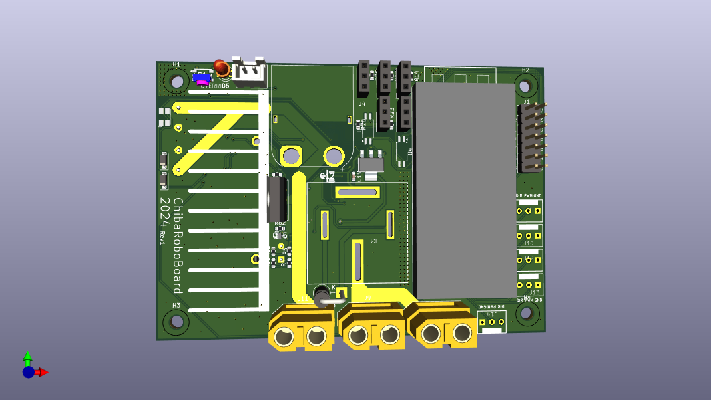
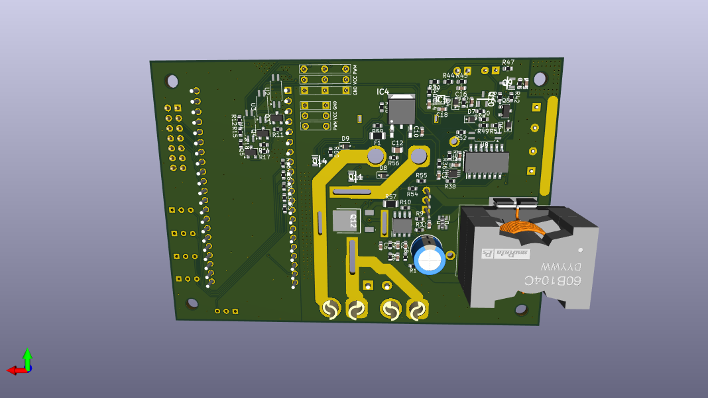
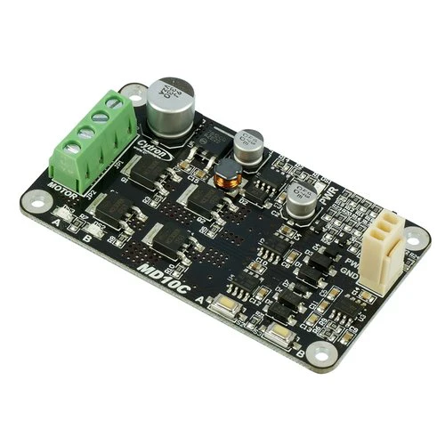

# chiba_robo_board_2024
## 概要
ちばロボ2024に参加する1年生向けの制御基板です。

## 機能一覧
- マイコンボードESP32S2-DevKitM-1で操作可能
- Cytron MD10C向けコントロールピンx5
- 60kgサーボ向けコントロールピン&amp;7.5V/5A高効率電源
- マイコンボード直結GPIOピン
- 12~24VDC/50Aのアクチュエータ電源
- 外付け非常停止スイッチ
- ソフトスタート内蔵

 前面

 背面

# マイコンボード
本基板はESP32S2-DevKitM-1でアクチュエータ類を操作します。基板上のピンソケットに、シルクに描画されている向きに従ってESP32S2-DevKitM-1を差し込んでください。

各種アクチュエータ/センサとマイコンボードのピンアサインは以下のとおりです。
| ピン | アクチュエータ/センサ | 説明 |
| ----- | ----- | ------ |
| 1 | DCモーター1 | DCモーター1のPWM信号 |
| 2 | DCモーター2 | DCモーター2のPWM信号 |
| 3 | DCモーター3 | DCモーター3のPWM信号 |
| 4 | DCモーター4 | DCモーター4のPWM信号 |
| 5 | DCモーター5 | DCモーター5のPWM信号 |
| 6 | DCモーター1 | DCモーター1のDIR信号 |
| 7 | DCモーター2 | DCモーター2のDIR信号 |
| 8 | DCモーター3 | DCモーター3のDIR信号 |
| 9 | DCモーター4 | DCモーター4のDIR信号 |
| 10 | DCモーター5 | DCモーター5のDIR信号 |
| 11 | サーボモーター1 | サーボモーター1のPWM信号 |
| 12 | サーボモーター2 | サーボモーター2のPWM信号 |
| 13 | サーボモーター3 | サーボモーター3のPWM信号 |
| 14 | サーボモーター4 | サーボモーター4のPWM信号 |
| 15 | サーボモーター5 | サーボモーター5のPWM信号 |
| 42 | 非常停止ボタン | HIGH: 非常停止ボタンが押されて**いない** LOW:非常停止ボタンが押されて**いる** |
| 5V || ロジック電源で動く回路の電源 |
| GND || ロジック電源で動く回路の共通電位 |

# Cytron MD10C向けコントロールピン
Cytron製モータードライバ「Cytron MD10C」向けのDIR/PWM/GNDピンを提供します。

DIRピンのHigh/Low切り替えにより、回転方向を変化させます。

PWMピンから出力するPWM信号のデューティー比により、回転速度を変化させます。

GNDピンの電位は、マイコンボードのGNDピンと同電位です。

DIR/PWMピンの出力インピーダンスは2.2kOhm、ロジック電圧は3.3Vです。

# サーボモーター電源/コントロールピン
60kgサーボ向けの7.5V/5A電源および、マイコンボードと絶縁されたPWM信号を提供します。

基板上のピンヘッダに、サーボモーターのQIコネクタを接続するだけで使用できます。

最大5個まで接続可能です(最小動作電流1Aの場合)。

> [!WARNING]
> 3.3Vや5Vで動作するサーボモーターを接続しないでください。サーボモーターが焼損する可能性があります。

# マイコンボード直結のGPIOピン
その他のアクチュエータおよびセンサを接続可能なGPIOピンを備えています。また、特定のGPIOピンからは、EMS信号(非常停止ボタンの信号)を取り出すことができます。(EMS信号を除き)出力電圧/電流は、ESP32S2-DevKitM-1の駆動能力に依存します。すなわち、3.3V/&pm;15mAの駆動能力を持ちます。

EMS信号は3.3V出力で、2.2kOhmの出力インピーダンスを持ちます。

# 12~24VDC/50Aのアクチュエータ電源
アクチュエータの動作に必要な電源を供給するための、電源ハブ機能を備えています。12~24VDC/50Aの範囲の直流電流を流すことができます。

# 外付け非常停止スイッチ
外付けの非常停止スイッチ(NO接点)を使うことで、非常時にアクチュエータ電源を遮断します。また、非常停止スイッチが扱われた際は、マイコンボードに信号が送られます。

外付け非常停止スイッチを使用しない場合、OVERRIDEボタンを使用することで、非常停止機能を一時的に無効にできます。

# ソフトスタート内蔵
バッテリーや端子への負荷を軽減するため、簡易的なソフトスタート機能を備えています。この機能は、電源投入から100ms間、アクチュエータ電源および電源コントロールロジックの総消費電流を500mAに制限します。これは、アクチュエータ電源に2000uFまでの容量性負荷を接続することを可能にします。